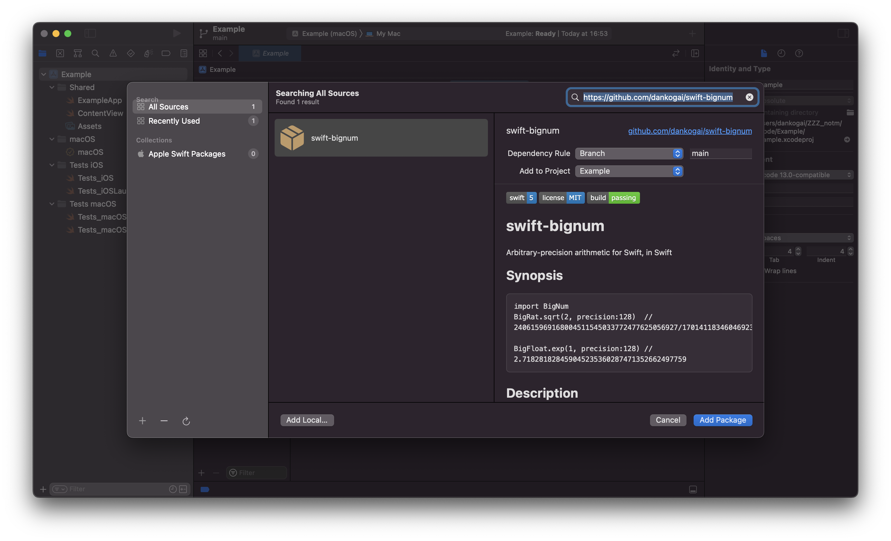
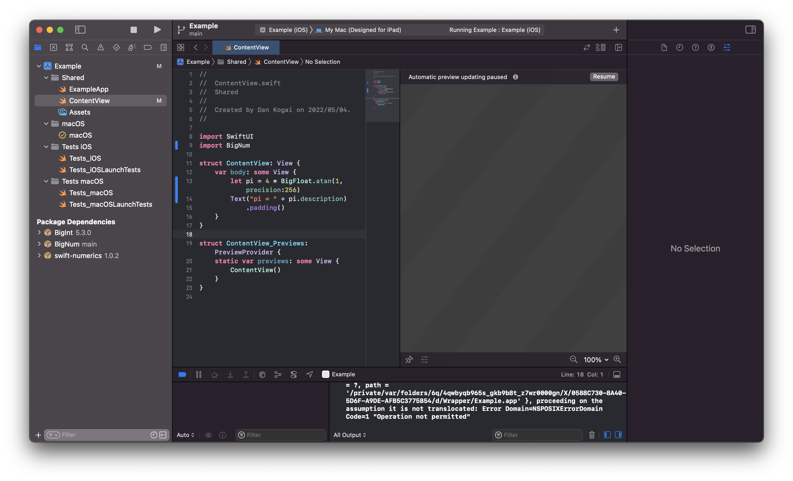
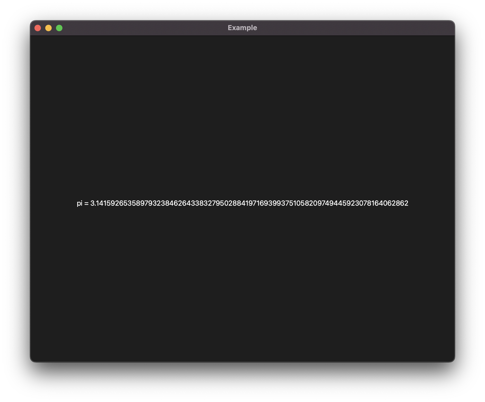

[](https://swift.org)
[](LICENSE)
[](https://github.com/dankogai/swift-bignum/actions/workflows/swift.yml)

# swift-bignum

Arbitrary-precision arithmetic for Swift, in Swift

## Synopsis

````swift
import BigNum
BigRat.sqrt(2, precision:128)  // 240615969168004511545033772477625056927/170141183460469231731687303715884105728
BigFloat.exp(1, precision:128) // 2.718281828459045235360287471352662497759
````

## Description

This module offers two flavors of Arbitrary-precision types that conforms to [FloatingPoint].

* `BigRat`   - Arbitrary-precision rational number.
* `BigFloat` - Arbitrary-precision floating point.

[FloatingPoint]: https://developer.apple.com/documentation/swift/floatingpoint

In addition to all arithmetic operations that [FloatingPoint] supports.  Most of the functions in `<math.h>` are offered as static functions.  As you see in the synopsis above, all arithmetic functions and operators that are lossy can take `precision:Int` as an optional argument.  When omitted the value of `BigRat.precision` or `BigFloat.precision` is used (default:64).

```swift
BigFloat.sqrt(2) // 1.41421356237309504876
BigFloat.precision = 128
BigFloat.sqrt(2) // 1.414213562373095048801688724209698078569
```

`BigInt`, an arbitrary-precision interger type is internally used and re-exported so you don't have to `import BigInt` just for that.  `BigInt` is also extended with `.over()` method so instead of constructing `BigRat` directly, you can:

```swift
BigInt(3260954456333195553).over(BigInt(2305843009213693952)) // == BigRat.sqrt(2)
```

## Usage

### Build

```sh
$ git clone https://github.com/dankogai/swift-bignum.git
$ cd swift-bignum # the following assumes your $PWD is here
$ swift build
```

### REPL

Simply

```sh
$ scripts/run-repl.sh
```

or

```sh
$ swift run --repl

```

and in your repl,

```sh
[0/0] Build complete!
Launching Swift REPL with arguments: -I/Users/dankogai/github/swift-bignum/.build/x86_64-apple-macosx/release -L/Users/dankogai/github/swift-bignum/.build/x86_64-apple-macosx/release -lBigNum__REPL -I/Users/dankogai/github/swift-bignum/.build/checkouts/swift-numerics/Sources/_NumericsShims/include
Welcome to Swift version 5.5.2-dev.
Type :help for assistance.
  1> import BigNum 
  2> var bf = BigFloat.sqrt(2, precision:128)
bf: BigNum.BigFloat = {
  scale = -127
  mantissa = {
    magnitude = {
      kind = array
      storage = 2 values {
        [0] = 6448461645324402335
        [1] = 13043817825332782212
      }
    }
    sign = plus
  }
}
  3> print(bf)
1.414213562373095048801688724209698078569
````

### From your Xcode Projects.

Simply add the package from **Package Dependencies** tab of the Project.
Enter `https://github.com/dankogai/swift-bignum` in the search field and click `[Add Package]`



Now you are able to `import BigNum`.



Now all you have to do is build and enjoy!



If you enconter errors like `Missing required module '_NumericShims'`, try cleaning up your `~/Library/Developer/Xcode/DerivedData`.

### From Your SwiftPM-Managed Projects

Add the following to the `dependencies` section:

```swift
.package(
  url: "https://github.com/dankogai/swift-bignum.git", .branch("main")
)
```

and the following to the `.target` argument:

```swift
.target(
  name: "YourSwiftyPackage",
  dependencies: ["BigNum"])
```

Now all you have to do is:

```swift
import BigNum
```

in your code.  Enjoy!

# Prerequisite

Swift 5 or better, OS X or Linux to build.

* Depends on [attaswift/BigInt] for internal representation of
`BigFloat` and `BigRat`.
* Depends on [apple/swift-numerics] since
version 5.1 for the `ElementaryFunctions` protocol.
* Prior versions depended on [dankogai/swift-floatingpoint] for the
`FloatingPointMath` protocols but it is replaced by the
`ElementaryFunctions`.

[attaswift/BigInt]: https://github.com/attaswift/BigInt
[apple/swift-numerics]: https://github.com/apple/swift-numerics
[dankogai/swift-floatingpoint]: https://github.com/danogai/swift-floatingpoint
